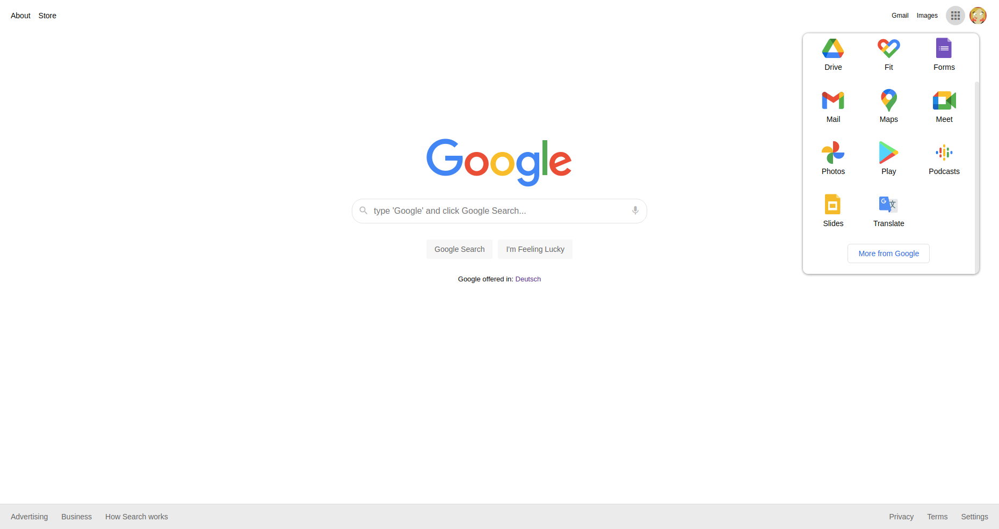

# google-into-google

Google Homepage deconstructed and rebuilt from scratch with a few easter eggs add just for the fun of it. :mag:

You can check out the page [here](https://lara-isak.github.io/google-into-google/).

### :thumbsup: Motivation behind the project
Better understanding of **elements' placement and alignment** on the page using **Flexbox and Grid** properties

### :seedling: What I learned
:arrow_right: difference between **Flexbox (one-dimensional)** and **Grid (two-dimensional)** layout  
:arrow_right: how to **structure content** in HTML based on its functionality (**header, nav, main, footer**)  
:arrow_right: how to use **:nth-child() CSS pseudo-class** to select elements based on their position in a group of siblings  
:arrow_right: how to position an element using **absolute and relative** position values  
:arrow_right: how to fix an **issue with an overflow property** and the padding / margin of the last element in a container

